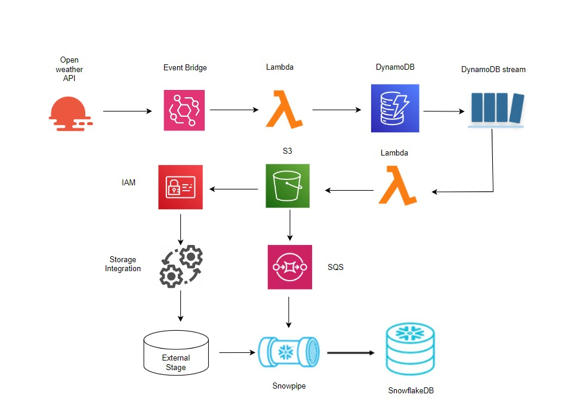

# AWS → Snowflake Real-Time Weather Data Pipeline

An end-to-end automated data pipeline that fetches live weather data
every hour and loads it into Snowflake for analysis.

---

## Architecture

---

## Tech Stack

| Service             | Purpose                           |
| ------------------- | --------------------------------- |
| AWS EventBridge     | Scheduled trigger (every 1 hour)  |
| AWS Lambda (Python) | Fetch weather + write to S3       |
| OpenWeather API     | Live weather data source          |
| AWS DynamoDB        | NoSQL storage with stream enabled |
| AWS S3              | Data lake storage (JSON files)    |
| AWS SQS             | Event notification queue          |
| Snowpipe            | Auto-ingest into Snowflake        |
| Snowflake           | Cloud data warehouse              |

---

## Pipeline Flow

EventBridge (hourly schedule)
↓
Lambda 1 → fetches from OpenWeather API
↓
DynamoDB (stores weather records)
↓
DynamoDB Stream triggers Lambda 2
↓
S3 Bucket (JSON files)
↓
SQS (S3 event notification)
↓
Snowpipe (auto-ingest)
↓
Snowflake Table (weather_raw)

---

## Project Structure

aws-snowflake-weather-pipeline/
│
├── lambda/
│ ├── lambda1_weather_fetch.py # Fetches weather from API → DynamoDB
│ └── lambda2_dynamodb_to_s3.py # DynamoDB stream → S3
│
├── snowflake/
│ └── setup.sql # All Snowflake setup SQL
│
├── architecture/
│ └── architecture1.jpeg # Pipeline architecture diagram
│
└── README.md

---

## Data Collected

| Field       | Description                 | Example             |
| ----------- | --------------------------- | ------------------- |
| city        | City name                   | Kochi               |
| timestamp   | Time of data fetch (UTC)    | 2026-06-18T11:46:00 |
| temperature | Temperature in Celsius      | 28.5                |
| humidity    | Humidity percentage         | 78                  |
| pressure    | Atmospheric pressure in hPa | 1012                |
| description | Weather condition           | light rain          |

---

## Setup Instructions

### AWS Side

1. Create DynamoDB table `weatherData` with `city` as partition key and `timestamp` as sort key
2. Enable DynamoDB Streams on the table (New and old images)
3. Deploy Lambda 1 with `OPEN_WEATHER_API` environment variable
4. Deploy Lambda 2 with `BUCKET_NAME` environment variable
5. Create S3 bucket and enable event notifications to SQS
6. Create EventBridge rule with `rate(1 hour)` targeting Lambda 1

### Snowflake Side

1. Run all SQL in `snowflake/setup.sql`
2. Create IAM role in AWS and update trust policy with Snowflake's IAM user ARN and external ID
3. Add S3 event notification using the SQS ARN from `SHOW PIPES`

---

## Author

**Vidhya Sugathan**  
Data Analyst | AWS | Snowflake | Python | SQL  
[LinkedIn](https://www.linkedin.com/in/vidhya-sugathan) | [Portfolio](https://vidhyasugathan.vercel.app)
